# dnn-ex3

## Question 1

### Training execution:

```python
    python Ex3_1.py
```

Comments:
1. Executing the VGG took very very very long time to train, so I have run with resnet50 instead due to lower memory footprint. 

### Train Execution result on various models:

1. 2 Conv - 2 FC Layers

    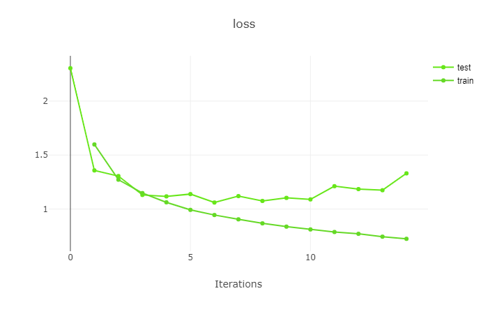

    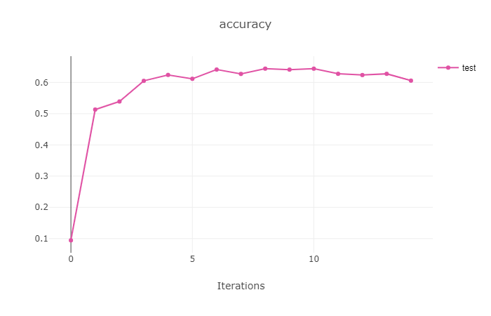

    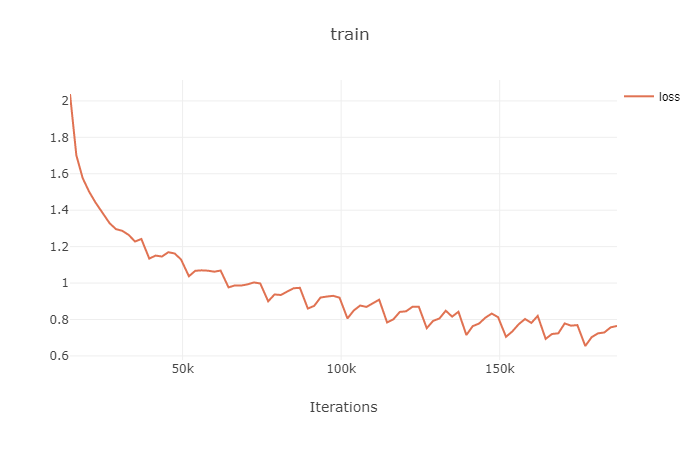

    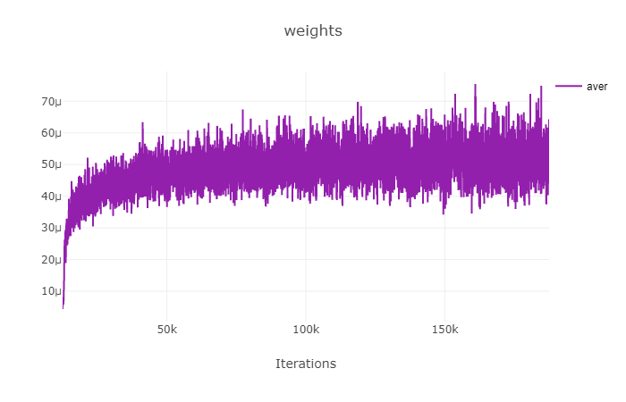

 1. 1 Conv 1 FC Layer
 
    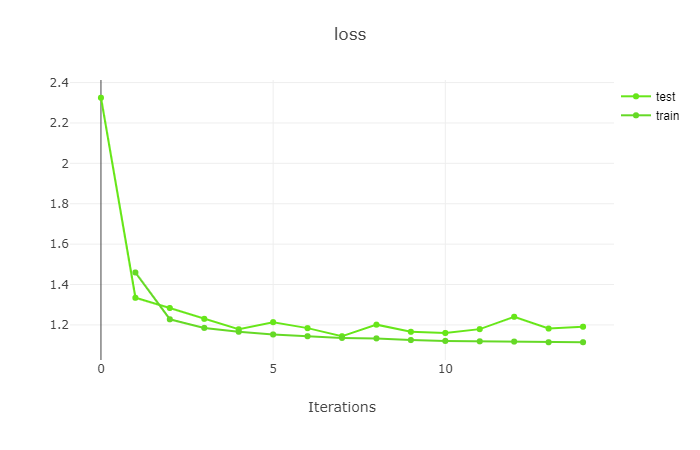

    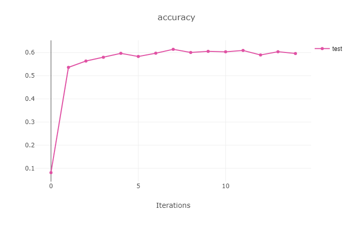

    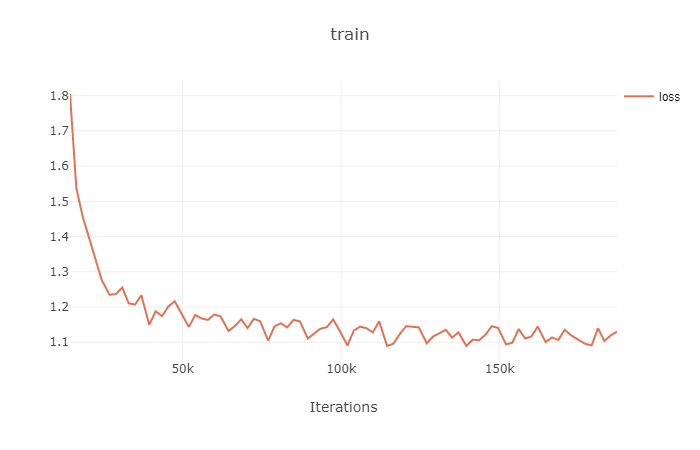

    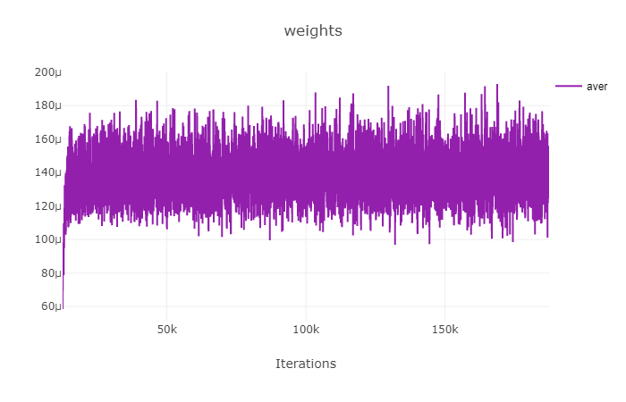

 1. 2 FC Layers

    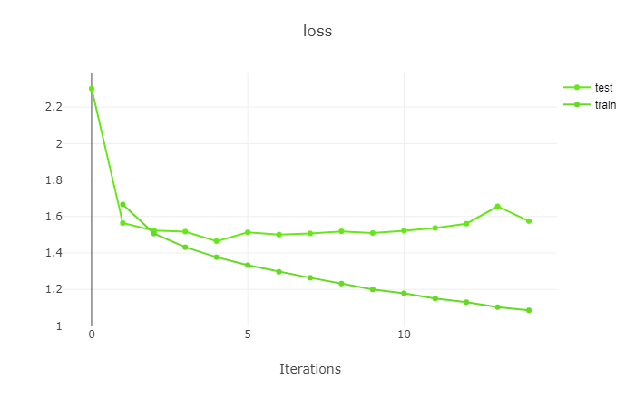

    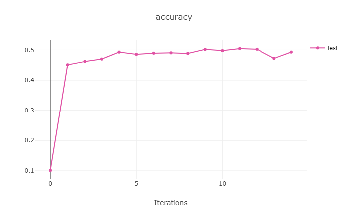

    

    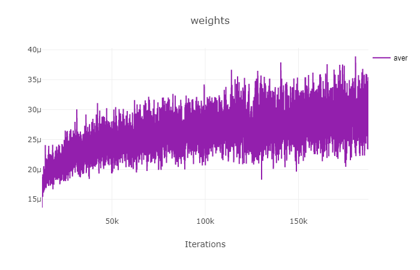 

1. 1 FC Layers

    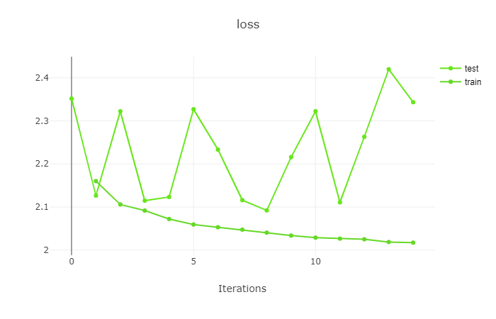

    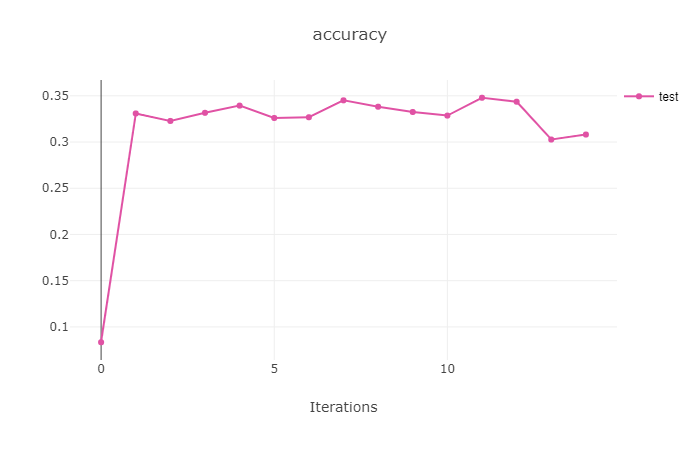

    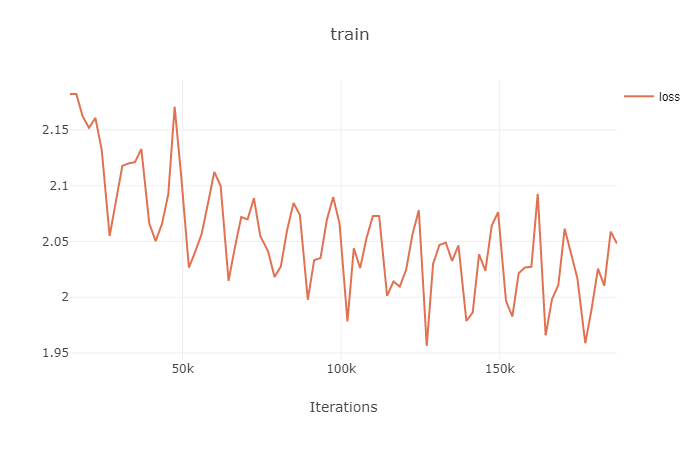

    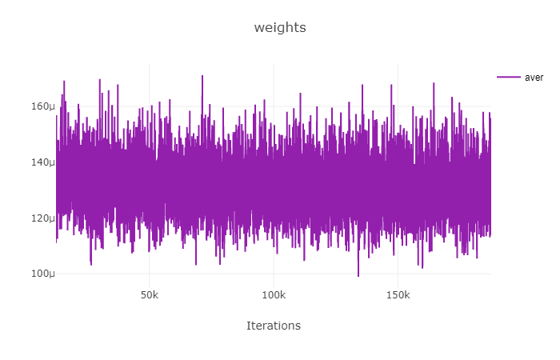

## Question 2

1. Train/test/valid datasets can be found on [here](https://drive.google.com/drive/folders/19PduWT-tEPssgwip1rgWiVApFRsl8Wkd?usp=sharing)
2. Training execution:
```python
    python Ex3_2_models.py
```
 it can take a while ...

5. Results:

 

 
 
 

