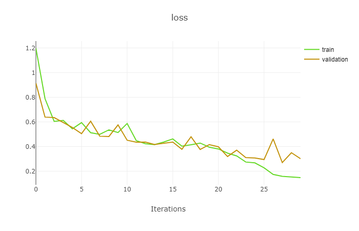
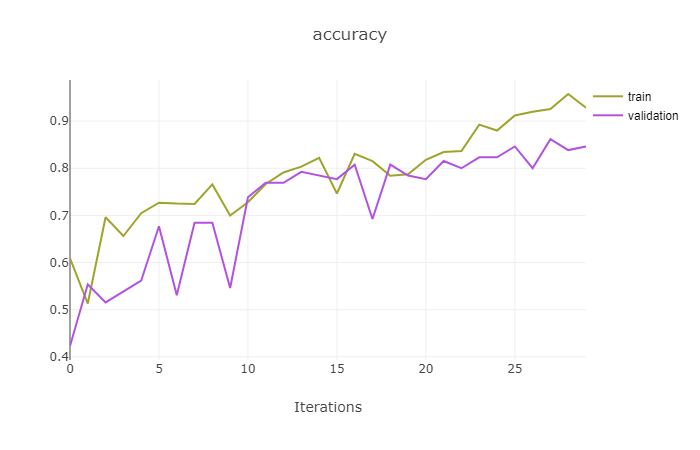

# dnn-ex3

## Question 1


## Question 2

1. Train/test/valid datasets can be found on [here](https://drive.google.com/drive/folders/19PduWT-tEPssgwip1rgWiVApFRsl8Wkd?usp=sharing)
2. Training execution:
```python
    python Ex3_1.py
```
 it can take a while ...

5. Results:

 

 
 
 

